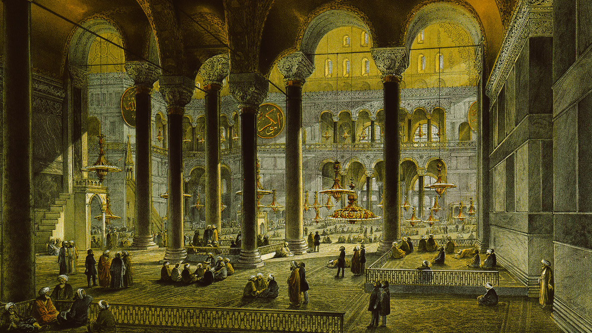
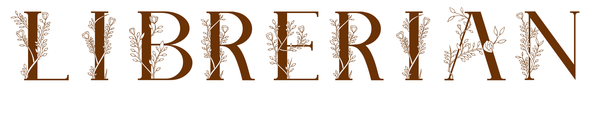

 

current version:  
**Dev-Build 2**

 
 

---
**Librerian** is open source software that is brought from idea that there's a need for database
storing all culture you've read, watched and listened, in one place.  
For good comparison, Librerian aims to be GoodReads, IMDB, Last.fm and other services at once, but
in local scope, and integrated with those services above (and others), so it is easy to migrate
your data.

---

 🎎 Socials: 
  

<tr>
        <td colspan="2" align="center">
            
            
        </td>
</tr>

---

 ⚙️ Development Stages: 
  

Currently, Librerian is in its infancy stage called <b>dev-build</b>. At this point, the software
itself is not usable and contributions to it are limited to translations.
  

---

 ✨️ Main Credits:  

<b>Everything:</b> Toma400

 ⭐️ Other Credits:  

<b>Readme image:</b> Fossati Gaspare "Vue Centrale de la Nef du Nord" (1852)
 
<b>Readme font:</b> <a href="https://www.dafont.com/plante.font">Plante</a>
 
<b>Translations:</b> Listed in every language file

  